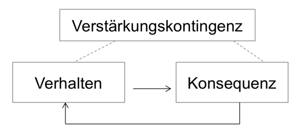

## Was ist operantes Konditionieren?

Eine Möglichkeit Unterrichtsstörungen zu vermeiden (Prävention) oder einzudämmen (Intervention), ist der gezielte Aufbau von wünschenswertem und konstruktivem Schüler*innenverhalten, sowie der Abbau von unerwünschtem und destruktiven Verhalten. 

Dafür ist es erforderlich, Verhaltensweisen in Abhängigkeit ihrer Konsequenz zu stabilisieren oder zu verändern: 
* Organismen lernen, dass auf ein bestimmtes Verhalten ein bestimmtes positives oder negatives Ereignis **folgt** (Konsequenz). 
* Verhalten wird wegen der darauffolgenden positiven oder negativen Konsequenz gezeigt bzw. nicht gezeigt. 
* So kommt es zum Aufbau einer Assoziation zwischen Verhalten und Konsequenz (Kontingenz).

In der pädagogischen Psychologie spricht man in diesem Zusammenhang von **operanter Konditionierung**.