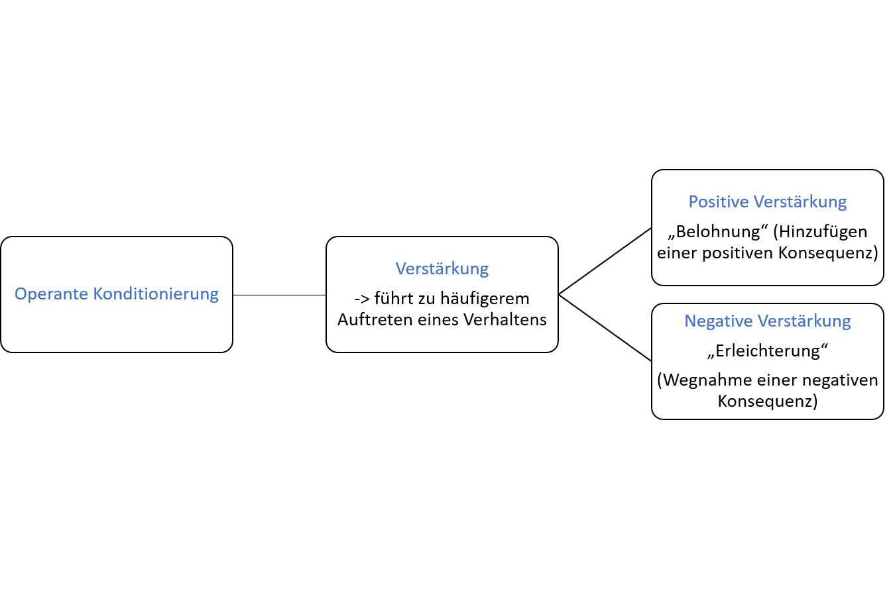
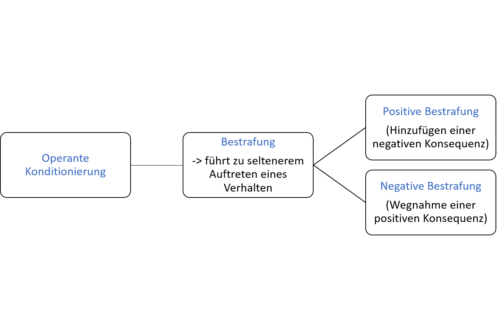

## Prinzipien operanten Konditionierens

*Verstärkung: Aufbau von Verhalten*

Mit Verstärkung lässt sich eine Erhöhung der Auftretenswahrscheinlichkeit eines Verhaltens bewirken. Dies kann auf zweierlei Arten geschehen: durch Darbietung einer angenehmen Konsequenz (**positive Verstärkung**) oder durch Entzug einer unangenehmen Konsequenz (**negative Verstärkung**). 

 
> * Positive Verstärkung (+): Es wird eine angenehme Konsequenz hinzugefügt.
> * Negative Verstärkung (-): Es wird eine unangenehme Konsequenz entzogen. 

In beiden Fällen führt Verstärkung dazu, dass ein Verhalten häufiger auftritt. 

*Bestrafung: Abbau von Verhalten*

Durch Bestrafung lässt sich eine Reduktion der Auftretenswahrscheinlichkeit eines Verhaltens bewirken. Dies kann ebenfalls auf zweierlei Arten geschehen: durch Darbietung einer unangenehmen Konsequenz (**positive Bestrafung**) oder durch Entzug einer angenehmen Konsequenz (**negative Bestrafung**). 

> * Positive Bestrafung (+): Es wird eine unangenehme Konsequenz hinzugefügt.
> * Negative Bestrafung (-): Es wird eine angenehme Konsequenz entzogen.

In beiden Fällen führt Bestrafung dazu, dass ein Verhalten seltener auftritt. 